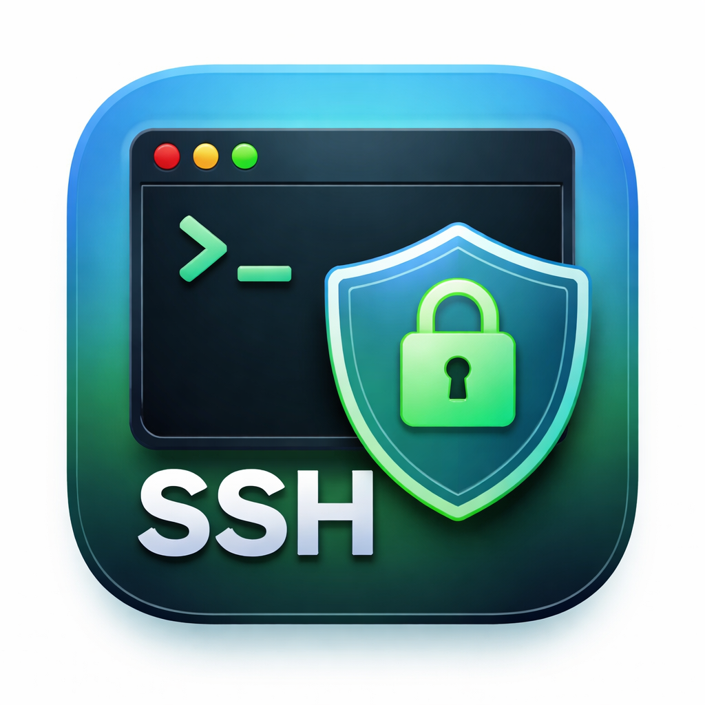

# SSH Manager



Подключение к серверам по SSH по сохранённым профилям. Есть консольный режим и GUI.

## Возможности

- Профили: host, port, user, пароль или SSH-ключ (RSA, Ed25519, ECDSA).
- Данные в `profiles.json` рядом со скриптом (пароли в открытом виде; предпочтительно ключи).
- **Консоль** (`main.py`): меню в терминале, несколько сессий, переключение Ctrl+N / Ctrl+P, выход в меню Ctrl+Q, закрытие сессии Ctrl+X.
- **GUI** (`gui.py`): окно со списком профилей и вкладками сессий, встроенный терминал (pyte), подсветка, Ctrl+C/Ctrl+V (копирование/вставка).

## Установка и запуск

```bash
pip install -r requirements.txt
```

**Консоль:**
```bash
python main.py
```

**GUI (без консоли в Windows — `pythonw gui.py`):**
```bash
python gui.py
```

Профили общие для обоих режимов.

## Запуск из любой папки

**Bash (Git Bash / WSL):** в `~/.bashrc`:
```bash
alias sshm='python "c:/Dev/ssh-manager/main.py"'
```

**Глобальная команда:** можно оформить проект как пакет с `console_scripts` и установить через `pip install .`.

## Сборка exe (Windows)

```bash
pip install pyinstaller
```

Консоль:
```bash
pyinstaller --onefile --name ssh-manager main.py
```

GUI (без окна консоли):
```bash
pyinstaller --onefile --noconsole --name ssh-manager-gui gui.py
```

Готовый exe в `dist/`. `profiles.json` ищется в папке с exe.
